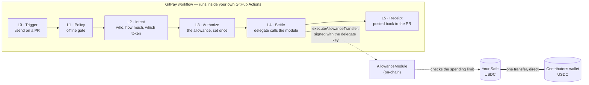
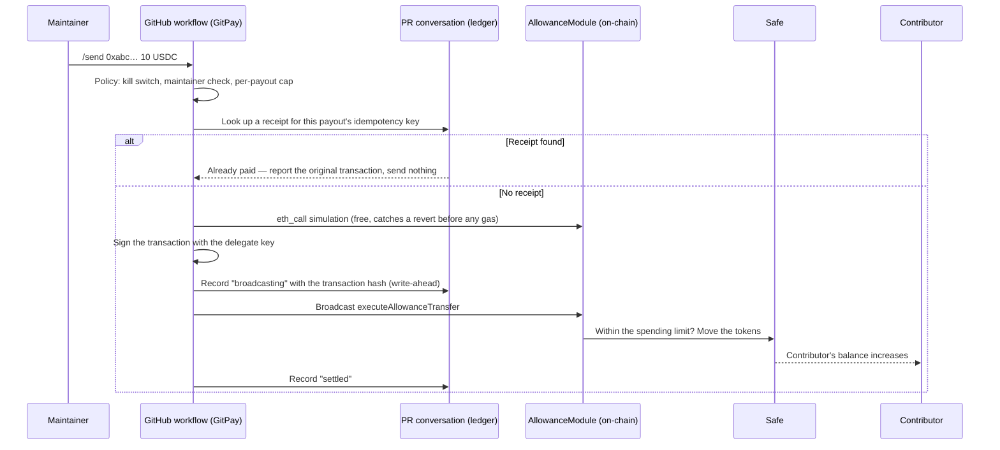

# GitPay Settlement Flow

How a payout actually moves. Tokens go once, on-chain, straight from your Safe to the
contributor. GitPay's code is never a party to that transfer and never holds the funds.

This describes the **Safe Allowance Module** model the code implements today (see
[DECISION-LOG.md](DECISION-LOG.md) §4). The earlier design, where a maintainer signed each
payout as an EIP-3009 authorization, is superseded.

## The idea in one paragraph

The Safe's owners set a **spending limit** once, in Safe{Wallet}: a delegate address may move up
to N tokens per period out of the Safe. The delegate's key is a secret in your repository. When
a maintainer types `/send` on a PR, the workflow checks policy, has the delegate call the
AllowanceModule, and the module moves the tokens from the Safe to the contributor. Nobody signs
anything per payout. The allowance is the authorization, and the chain enforces it.

## One-time setup

1. **Spending limit.** In Safe{Wallet}, go to Settings → Setup → Spending limits → New spending
   limit. Pick the delegate address, the token (testnet USDC), an amount, and a reset period.
   The first use deploys and enables the module. On Ethereum Sepolia the module is canonically
   deployed at `0xCFbFaC74C26F8647cBDb8c5caf80BB5b32E43134`.
2. **Delegate gas.** The delegate is an ordinary account and pays gas for each payout, so give
   it some Sepolia ETH.
3. **Workflow inputs.** Set `mode: self`, then `safe`, `token`, `rpc_url`, and `delegate_key`
   (a repository secret). Also set `pr` and `github_token`, because receipts are written to the
   PR. `chain_id`, `allowance_module` and `explorer_url` come from the chain registry and need
   no input unless you override them.

Without `mode: self`, every run is a dry run (I5). It resolves the payout and reports what would
happen, and moves nothing.

## Overview: pipeline vs. money

No box in the `GP` pipeline ever holds the token. The transfer is the bold arrow, from your Safe
to the contributor.

## Zoom in: `/send` → contributor's wallet

## Why this is safe, and what it trusts

**The spending limit is the ceiling.** The delegate can move no more than the allowance allows
per period, and only the token you picked. The chain enforces that, not GitPay. Leaked or
misused, the delegate key can spend the allowance each period until the owners remove the
spending limit, and nothing else in the Safe. Keep the allowance sized to what you would pay
out in one period, and remove the limit if the key is ever exposed.

**The delegate key is the trust boundary.** Whoever can read the `delegate_key` secret, or edit
the workflow that uses it, can spend the allowance. That is why policy runs first: `/send` is
honoured only from an author association in `allowed_associations`, and `max_per_payout` caps a
single payout (I10). The kill switch `enabled: false` stops everything.

**Exactly-once comes from the ledger, not the chain.** The AllowanceModule does not refuse an
identical second call. While the allowance has headroom, it would transfer again. So every
payout has a deterministic idempotency key (repo, ref, recipient, network, asset, round; never
the amount), and a receipt comment on the PR records it **before** the broadcast. A re-run finds
the receipt and reports "already paid" (I8, I9). Paying the same person again on the same PR is
a deliberate act: bump `round`.

**Serialize payouts.** A ledger lookup is check-then-act, so two runs at once could both miss.
Put payouts in a `concurrency:` group keyed on the PR.

## Layers, in plain terms

| Layer | What it does |
|---|---|
| L0 Trigger | A maintainer's `/send` on a PR, or workflow inputs, becomes an Intent. |
| L1 Policy | Offline checks before anything touches a chain: kill switch, who may send, per-payout cap. |
| L2 Intent | A plain description of what's owed: recipient, amount, token, network, round. |
| L3 Authorize | The Safe's spending limit, set once by the owners. No per-payout signature. |
| L4 Settle | Simulate, record the attempt, then the delegate calls the AllowanceModule. |
| L5 Receipt | A comment on the PR, which is both the human-readable receipt and the ledger entry. |

## Enforced invariants (per AGENTS.md)

- **I2** — GitPay never holds, pools, or routes funds. Tokens go from your Safe to the
  contributor.
- **I5** — the default mode is dry-run. Real settlement needs `mode: self`.
- **I8** — a repeated payout reports success and sends nothing.
- **I9** — the AllowanceModule has no native replay protection, so settlement refuses to run
  without a ledger.
- **I10** — no amount above `max_per_payout` reaches the driver.
